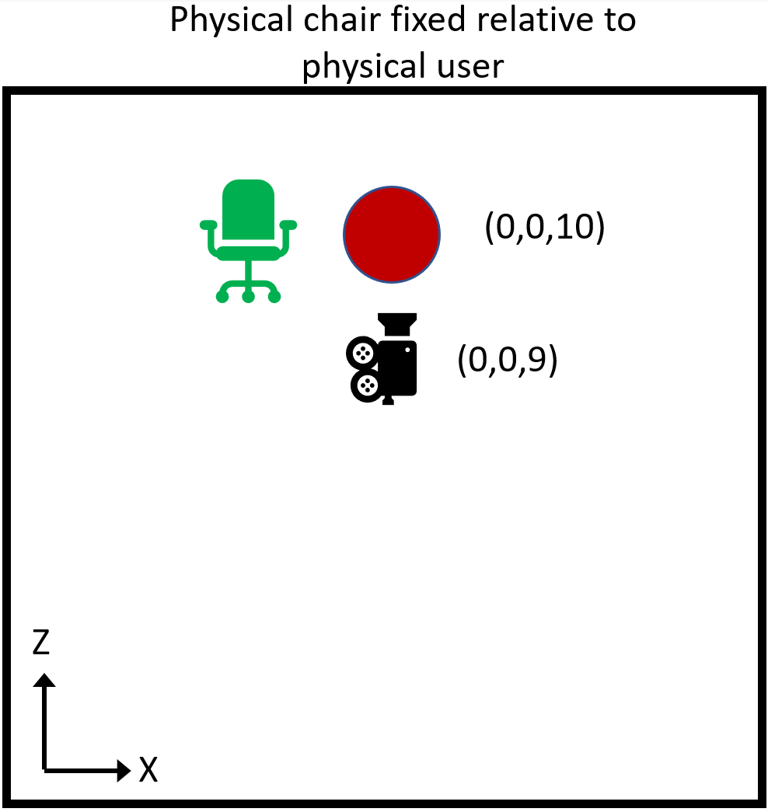
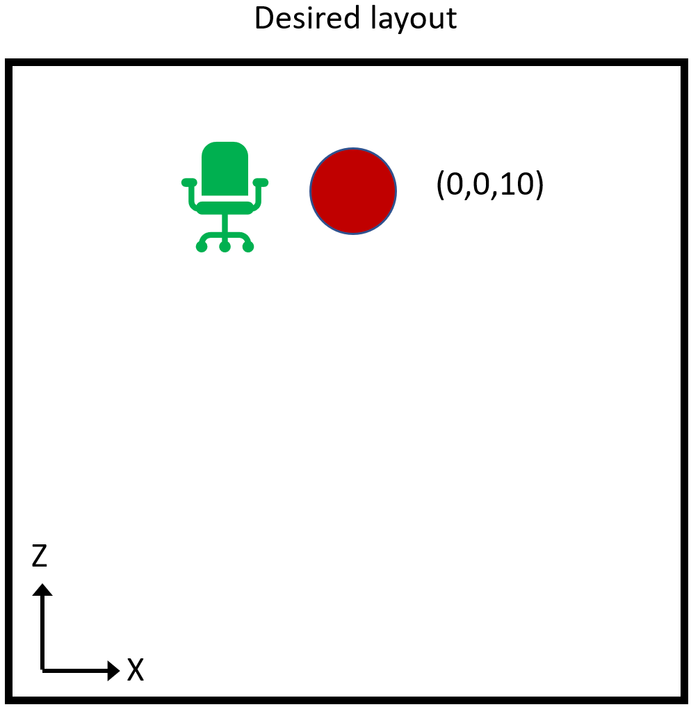
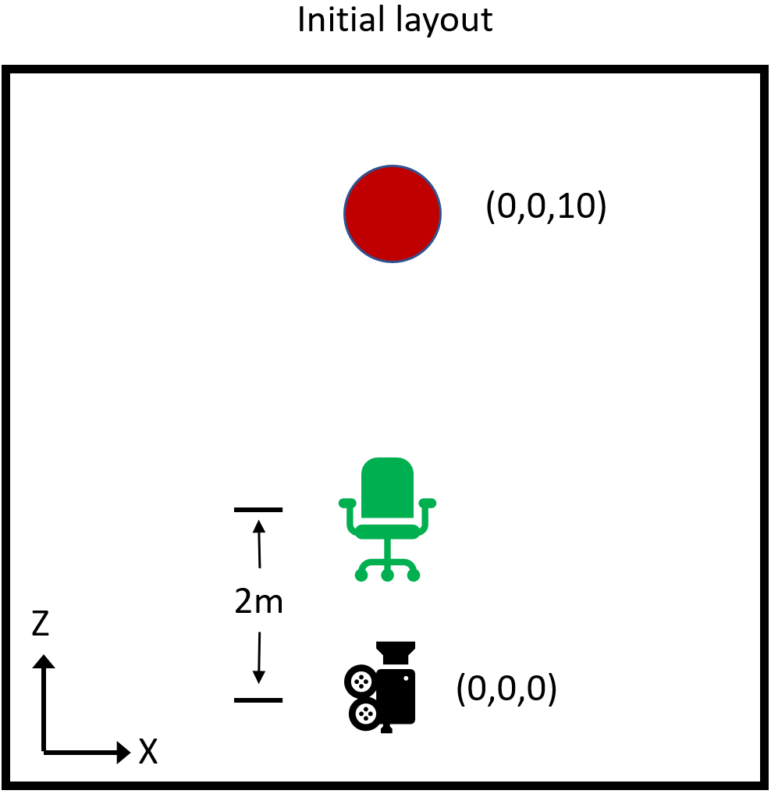

# Understanding the SessionOrigin

The SessionOrigin is a relatively new implementation, introduced in AR Foundation, but the idea has appeared in camera rigs going back decades of rendering engines. It is quite powerful, but unfortunately poorly explained and consequently poorly understood.

## What is the SessionOrigin?

The SessionOrigin is just a Transform object to which the camera is attached. Most plainly, it allows placement of the camera in the virtual scene. More subtly, it defines a special coordinate space.

As is usual with the transform parent-child relationship in Unity (and all modern rendering engines), "moving" the parent will "move" the child. What's meant by the term "move" in this context is that a change in the global pose of the parent will change the global coordinates of the child, and when the global coordinates of one object change, that object will appear to have moved relative to objects whose global coordinates have not changed.

The camera is rather special in this sense, as it is not rendered. It determines the renderer's viewpoint. A concrete example might clarify this.

## Simplest example of SessionOrigin

Imagine a very simple scene, in which the camera is at the origin at startup (as is normal in AR applications), and there is a single red sphere placed on the Z-axis 10 meters in front of the camera (position=(0,0,10)).

For whatever reason, imagine that we want the user to start 1 meter away from the sphere instead.

We have two interesting options:

1. Move the camera to new position (0,0,9).
2. Move the sphere to new position (0,0,1).

It's fairly obvious that the two options are ultimately equivalent without any other context. In both cases, at startup the sphere is 1 meter in front of the camera. The only difference is the absolute global coordinates of the two objects. Their relative coordinates, that is the vector between the two, is the same in either case.

If we want to use option 1., how would we go about it? If we set the coordinates of the camera, they will be overwritten by the tracking system. Instead, we attach the camera to a parent object, then move the parent. The tracker sets the local pose of the camera, which moves it relative to the parent. The parent is now the SessionOrigin.

## Why move the camera instead of the sphere?

In this simple case, the two options are clearly interchangeable. But remember that "the sphere" really represents "everything in the scene but the camera". As the complexity of the scene grows, moving everything becomes more complicated. Moving the camera, via the SessionOrigin, is always the exact same operation.

Furthermore, there are types of objects which are difficult or impossible to reposition, such as particle systems or navigation meshes. But even if none of those are involved, there are clear advantages to changing the coordinates of a single object in the scene, the SessionOrigin, versus changing the global coordinates of everything else.

## The SessionOrigin shouldn't move everything

Consider again our simplest example. But this is an AR application, so along with the rendered red sphere, the user will also see the physical environment. In the interest of simplicity, our physical environment will be limited to the single green chair as shown.

Now, when we move the camera via the SessionOrigin, we have moved it relative to the red sphere, but obviously we haven't picked up the user and moved them relative to the green chair. The sphere now appears closer, but the chair is in the exact same position.

What if there is an anchor on the chair seat? Should the anchor move with the red sphere, or remain fixed relative to the chair seat? The whole point of the anchor is to remain fixed relative to the physical world, so clearly it should stay with the chair.

Another example is the spatial mesh. That's the mesh generated to provide a virtual version of the physical environment for context, ray-casting, etc. We definitely want the spatial mesh to remain fixed to the physical world.

Further examples range from hand meshes to eye gaze vectors. All share the common trait that if the coordinates of the camera are adjusted (transformed), then the coordinates of those objects should receive the same adjustment.

So conceptually, all of those objects that move in coordination with the camera, are also attached to the SessionOrigin. When the SessionOrigin is moved relative to global objects like the red sphere, all of those objects are brought along with it.

It's important to stress that this is independent of the motion of the camera due to head tracking. The tracker moves the camera relative to the SessionOrigin.

## A slightly more mathematical explanation

Unity's global coordinate system is somewhat arbitrarily located by default in an AR application. Aside from aligning the gravity vector (Y-axis) with "up", the position and orientation are entirely determined by where the tracker places the camera at startup.

While that may be fine for many applications, a wide range of possibilities are opened up by being able to remove that arbitrariness of the global coordinate space.

Looking back at the previous example, imagine that it is significant for the application that the virtual red sphere be positioned relative to the physical chair as shown. We can accomplish that by adjusting the SessionOrigin.

If we want the sphere at (0,0,10) to be 1 meter along the X-axis from the chair, then we want the chair to be at (-1,0,10). If we determine the camera to be 2 meters back from the chair directly along the negative Z-axis when the camera is at the origin, then the chair is currently at (0,0,2). (Remember, physical objects have no innate coordinates, only coordinates implied by proximity to the camera and virtual objects).

However, if we set the SessionOrigin transform to (-1,0,8), now the camera's position is (-1,0,8). The chair, 2 meters directly ahead, is at (-1,0,10). And the red sphere, at (0,0,10), will appear 1 meter right of the chair as desired.

So we have effectively used the SessionOrigin transform to reposition Unity's global space so that the red sphere, and all other global objects, just happen to appear in the correct position relative to the physical world.

This simple but powerful mechanism for aligning Unity's global coordinate space to the physical world can be leveraged to support complex layout, persistence of coordinate spaces, coordinate spaces shared across devices, and more.
