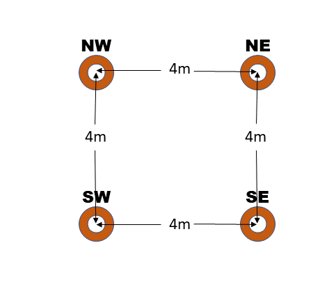
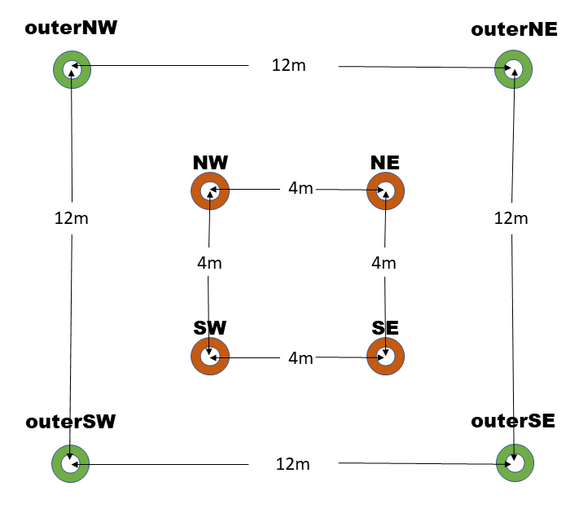
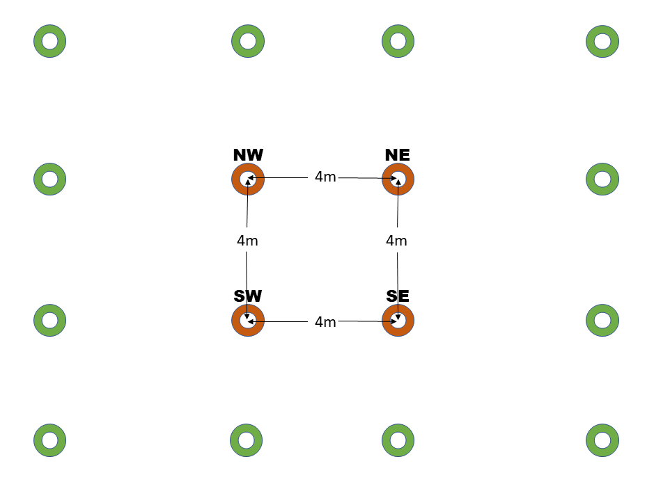

# Space Pins

## The problems to solve

### The scale error

While the traditional spatial anchor approach to aligning Holograms with real world features works great on a small scale, it struggles as the scale grows to encompass more than a meter or so.

Scale error in head tracking space means that even if a spatial anchor keeps one end of a virtual object, sized only a few meters long, perfectly aligned with a real world feature, the other end is likely to be misaligned with a corresponding real world feature. This is because the distance traveled through head tracked space tends to differ from the distance traveled through physical space with an error bound of +-10%. The actual error is often less (it depends on a number of environment and device characteristics), but will generally be significant, and grow without bounds as the scale of the project grows.

Put another way, if a user wearing a HoloLens walks ten meters in the real world, the distance travelled in virtual space, as reported by the head tracker, will be between 9 and 11 meters. If the user walks 50 meters, the error grows to +-5 meters. The farther the user walks, the greater the error grows.

Thus, a 10 meter beam (in modeling space) with one end point perfectly aligned to the zero end of a tape measure in real space will have the other end registered to the tape measure at somewhere between 9 and 11 meters.

For the same reasons, multiple objects, each world locked using spatial anchors, will be different distances apart in virtual space than in real space.

### The arbitrary coordinate system

There is an additional concern. The Unity coordinate system in HoloLens is indeterminate. It is based solely on the head pose at the start of the application.

This is not an issue for many tasks. If the goal is to cast a ray into the spatial mapping of the room and place a Hologram at the hit position, then the numerical values of the hit position are irrelevant.

Likewise, when popping up UX elements around the user, the absolute coordinates to place a UX element don't matter, only the coordinates relative to the user.

However, more involved scenarios can be complicated by the unpredictable coordinate system. To load a large collection of objects, for example a user's desktop or an entire office room, into virtual space with a fixed relation to physical space, requires some compensating transform to align the modeling space objects with the head based coordinate frame. 

That compensation is often done by attaching all objects to a single Unity transform, and adjusting that single transform to position and orient the virtual objects in alignment with the real world.

Equivalently, a single transform in the camera's hierarchy can be used to realign the camera so that when the user is seeing a real world reference point, a virtual object with the desired modeling coordinates will appear overlaid on that feature.

## The solution

The Space Pinning feature addresses both of these issues at once. It does so by leveraging both the world-locked nature of the World Locking Tools global space, and the arbitrariness of that space.

### Aligning Unity space wth the real world

World Locking Tools at its core provides a stable world locked coordinate system. This means that a virtual object placed into World Locked Space registered with a real world feature will remain registered with that real world feature over time.

But there are an infinite number of spaces that satisfy that goal. In fact, given one world-locked space, transforming it by any arbitrary position and rotation produces another equally valid world-locked space.

The Space Pin feature applies an additional constraint that removes the indeterminate nature of the world-locking transform.

That constraint is that when "near" a Space Pin, the pose of that Space Pin in world-locked space will be the same as the pose of the Space Pin in modeling space.

Consider a cube in a Unity scene modeled at global coordinates of (0, 0, 1). When the scene is loaded into HoloLens, the cube will appear 1 meter in front of the initial head pose. Depending on the initial head pose, that might be anywhere in the physical room.

The Space Pin allows that cube to be locked to a real world feature in the room, e.g. the corner of a specific desk. Unlike locking the cube with a spatial anchor, the Space Pin moves the entirety of Unity space such that the cube is aligned with the desk corner. So, for example, other desktop items modeled relative to the cube in Unity will be dispersed properly across the real desktop.

### Addressing the scale error

While a single Space Pin removes the indeterminacy of the relation between virtual coordinate and the real world, it doesn't address scale error.

That is, while it may have moved the origin to a physical world aligned position and orientation, walking 10 meters in the real world might still only move the user 9 meters in virtual space.

For this, multiple Space Pins provide the complete solution. When near any specific Space Pin, the world will be aligned according to that Space Pin. The other Space Pins will be off, but being more distant, that generally proves to be acceptable, and often imperceptible. 

As the user moves between Space Pins, a smooth interpolation minimizes the scale error at any given point in space. With an adequate density of Space Pins as reference points, misalignment of real world and virtual features is reduced to the order of head tracker error.

While the required density of Space Pins depends on both the tracking quality the environment supports and the precision requirements of the application, some numbers here might help set expectations. In an office environment, with adequate lighting and visible features to track, a spacing of 10 meters between Space Pins reduces error from an accumulation of 10-20 cm over 10 meters, down to millimeter errors (max error l.t. 0.5cm, 0.0 error at endpoints).

## Persistence

The Space Pin feature works in tandem with the rest of World Locking Tools' persistence. There are both manual calls for invoking saving and loading from script, and flags for automated saving and loading per session.

When enabled, the AutoSave/AutoLoad feature on the World Locking Tools Manager will allow the full spatial alignment of the virtual world to the real world to be restored on subsequent sessions.

In practice, this means that a single or small number of preliminary sessions may be used to establish an adequate scan of the physical environment, and alignment of that physical environment with Unity's modeling coordinate space. Subsequent sessions will then load the virtual environment correctly aligned with the real world without further user action required.

## Interpolation and extrapolation

Interpolation and extrapolation are both techniques for estimating data values where no direct measurement has been made. The space pins, as discussed so far, are locations where measurements have been made. The virtual coordinates are the desired coordinates, and the physical coordinates are measured coordinates we want those virtual coordinates to appear at.

The system performs interpolation, but not extrapolation, as discussed below. In general, interpolation is safer and more stable than extrapolation. The piecewise linear interpolation provided will fulfill most applications' needs. Extrapolation is less safe, and its ideal implementation generally requires knowledge at the application level. It is therefore left for the application to handle extrapolation as described below. 

Without the application adding extrapolation pins, outside the bounds of the pins the space is pinned exclusively by the value at the nearest boundary. If there are only two pins, A and B, then as the user moves from A to B the pinning blends between that specified by A and that specified by B (interpolation). But when the user passes B then the pinning locks to exactly that specified by B (constant extension).

### Interpolation

In the 2D region between pins, the spatial localization is linearly interpolated. This means that if the space pins are accurately placed, and the tracking error is evenly distributed over the region, then the correction applied in between the space pins will be exactly correct.

It should be stressed here that the assumption of equal error distribution is exactly not correct. However, as an approximation, the linear model provides excellent correction results.

### Extrapolation

The system provides no built-in extrapolation service, using constant value extension outside the convex hull of space pins. This is equivalent to assuming, incorrectly of course, that there is no scale error outside the application provided space pins.

However, if the application has knowledge about the error distribution, or is satisfied with an estimate, it can create any extrapolation desired by adding more space pins in the periphery.

### Extrapolation example

Consider a scene with four space pins, placed in a square with edges 4 meters long.

Now, let's say that the actual space the user will be moving around in is twelve by twelve (12 x 12) meters, with the physical markers corresponding to the 4 pins surrounding the center of the space. 

If the application is satisfied with a constant error approximation, then it has all the information it needs to add 4 or more space pins to provide coverage over the entire 12x12m space.

We'll label the pins at the corners of the 4x4 square by their cardinal directions, NE, NW, SW, and SE. We'll also label the virtual positions at each point virtualNE etc, and the physical positions at each point physicalNE etc.



One strategy would be to add outer cardinal points creating a 12x12 meter square surrounding the inner square, by adding 4 more cardinal points, outerNE, outerNW, outerSW, and outerSE. The virtual and physical positions of each of these is simple to compute. Taking outerNE for example:

```lang-cs
virtualOuterNE = virtualNE + (virtualNE - virtualSW);
physicalOuterNE = physicalNE + (physicalNE - virtualSW);
```



Note that creating an extrapolation space of 20x20 meters only changes the scale of the delta applied:

```lang-cs
scale = (outerSize - innerSize) / innerSize / 2;
virtualOuterNE = virtualNE + (virtualNE - virtualSW) * scale;
physicalOuterNE = physicalNE + (physicalNE - virtualSW) * scale;
```

With an outerSize of 20m, and an innerSize of 4m, the scale would be 2.

An alternate strategy might be to add eight more points in addition to the corners as shown below. Computing the new pin locations from the existing ones is exactly as above. Be cautioned that, while it is true that adding additional pins generally improves stability, it does not necessarily improve accuracy. 



## Aligning a subset of the scene

The discussion so far pertains to the global AlignmentManager, owned and managed by the WorldLockingManager.GetInstance(). As previously described, this pins the entire global Unity coordinate space to physical features at strategic reference points.

However, there are times when applying the same concept to a subset of the scene.

For example, consider a scenario in which annotations for two automobiles are to be loaded. The exact placement of the two physical automobiles can't be known ahead of time, as it might vary according to layout of different dealerships. However, once one of the physical vehicles has been deployed, the positions of all component parts relative to that deployment pose is known.

In this scenario, then, Space Pins can be used to pin the virtual chassis and annotations for each of the vehicles independently. The entire virtual representation of each of the vehicles can be setup in Unity, and then mapped onto the physical vehicle at runtime. This alignment might be manual using MRTK UX or automated using QR codes or any other strategy. Regardless of how the data of the correspondence between virtual and physical reference points is determined, once fed to the WLT via the Space Pins API, WLT will keep the virtual and physical objects aligned in a perceptually optimized manner.

In the case of aligning the global coordinate space, the alignment happens by manipulating the Adjustment node (generally the parent of the parent of the camera). That node should be considered reserved for the WLT's use. Any other tampering with that transform will result in undefined behavior.

Likewise, when aligning a subtree, the alignment needs to own a transform, at the (sub)root of the subtree to be aligned. Any external tampering with that transform will result in undefined behavior.

Note that before the independent spaces are pinned, they will be dragged along as the global space is pinned. However, once an independent space is pinned, it is considered pinned to the physical world, and so subsequent modifications to the pinning of the global space to the physical world will not affect it.

### See also

* [Space Pin Sample](../../HowTos/Samples/SpacePin.md)
* [Ray Pins Sample](../../HowTos/Samples/RayPins.md)

### Also see

* [Attachment points](AttachmentPoints.md)
* [Fragments](Fragments.md)
* [Refit operations](RefitOperations.md)
