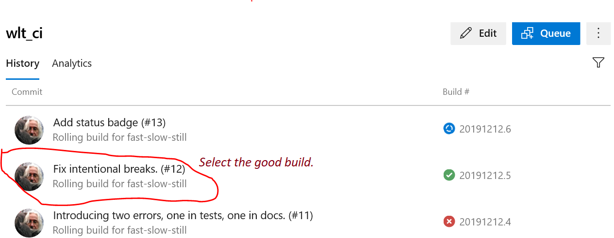
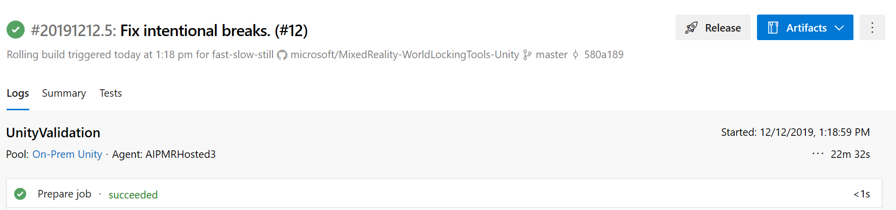
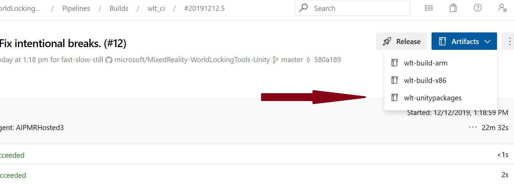
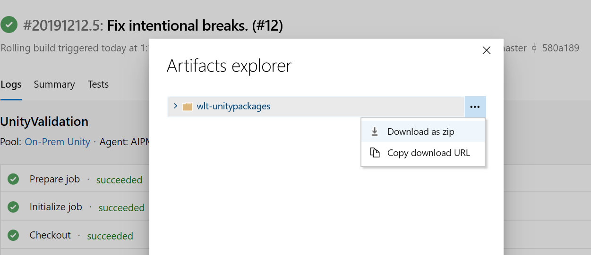

# Developing new code and documentation

Depending on access level, new code and documentation may be developed in a new feature branch, or in a fork. In general, working from a separate fork is preferred, and is sometimes the only alternative.

Best practices in git/GitHub development are outside the scope of this documentation, but further reading may be found [here](https://help.github.com/en/github/collaborating-with-issues-and-pull-requests/working-with-forks).

## Submitting a pull request (PR)

Any pull request should include a manual run through the CI build pipeline. The pipeline is triggered by adding a comment to the PR. The following will trigger a full build:

```
/azp run
```

If it is known that the changes are entirely restricted to either code or documentation, then only that side of the build may be run. For example, to check only code changes:

```
/azp run wlt_ci
```

Or to check only documentation changes:

```
/azp run wlt_docs
```

However, keep in mind that even changes restricted to code (.cs) files may trigger documentation changes. It is always safer to run the full build.

Please run the appropriate version after any significant changes to a PR, and before final completion of the PR. Remember, those tools are in place to protect contributors from breaking the build. Using them is to your own benefit, as well as the benefit of others working in the same space.

## Code review

All PRs must also be reviewed by another developer before they may be completed.

When performing code reviews, please maintain a friendly and collaborative atmosphere. It is always worth a little extra time to find a way to express a suggestion or correction which leaves the other side feeling positive about the changes.

# Publishing a new release

After thorough testing and stabilization, a new **safe** version of the product may be published.

The product is made available through two channels:

1) Via the open source GitHub repo, tagged for verified release commits.
2) Via published .unitypackage files.

Both channels are available on the [WLTU's GitHub releases page](https://github.com/microsoft/MixedReality-WorldLockingTools-Unity/releases).

## Building the unity packages

NOTE: The exact UI of the process described here is subject to frequent change. If what you see on your screen doesn't match the screenshots here, that's probably okay. Just look for the relevant keywords and follow through.

1) First, go to the [build pipeline page](https://dev.azure.com/aipmr/MixedReality-WorldLockingTools-Unity-CI/_build?definitionId=50). Be sure that "wlt_ci" is selected.

2) Select the build that matches the commit that will be the basis for the release.

  

3) That will lead to the following screen, from which the build artifacts may be accessed.*

  

4) Select the unity packages.



5) Then download as zip.



6) After installing and testing the packages, they may be integrated into a new release.

## Creating the release

### Update the Version field in code

Update the [WorldLockingManager.Version field](xref:Microsoft.MixedReality.WorldLocking.Core.WorldLockingManager.Version) to properly reflect the new version.

### Create a release branch

For example, create a branch named "release/v0.3.6-alpha". While somewhat redundant with the tag, this will facilitate hot-fixes to the release which wouldn't be suitable for the main development branch "master".

### Publish the release

Go to the [World Locking Tools for Unity releases page](https://github.com/microsoft/MixedReality-WorldLockingTools-Unity/releases).

Click the "Create a new release" button.

Specify a tag. The tag should be of the form vX.Y.Z[-prerelease-modifier]. This X.Y.Z of this tag are 3 integers which should match the version as specified in the [WorldLockingManager.Version field](xref:Microsoft.MixedReality.WorldLocking.Core.WorldLockingManager.Version). This should also match the release branch name.

Specify the release branch created above as the target.

Fill in the title and description fields appropriately.

Drag the .unitypackage files created [above](#building-the-unity-packages) into the rectangle labeled "Attach binaries by dropping them here or selecting them".

The large Examples package, which also contains a snapshot of its MRTK dependency, may take considerable time to upload. It is safest to not leave that page until the upload has completed successfully.

When the .unitypackage files have successfully uploaded, click the Publish Release button.

Verify that everything looks correct on the releases page.

