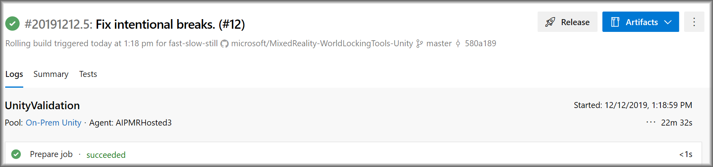
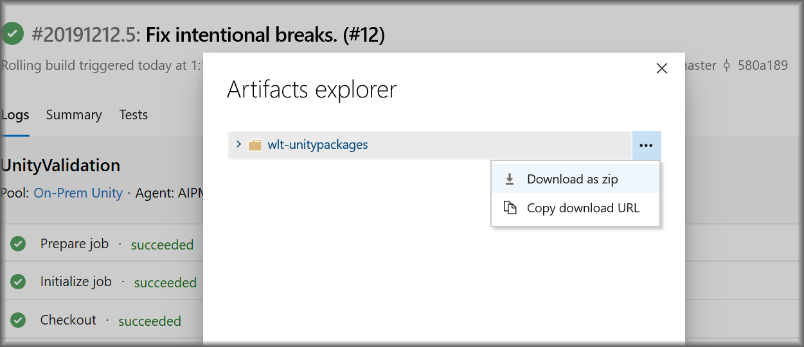

# Submitting new code

# Publishing a new release

After thorough testing and stabilization, a new **safe** version of the product may be published.

The product is made available through two channels:

1) Via the open source GitHub repo, tagged for verified release commits.
2) Via published .unitypackage files.

Both channels are available on the [WLTU's GitHub releases page](https://github.com/microsoft/MixedReality-WorldLockingTools-Unity/releases).

## Building the unity packages

First, go to the [build pipeline page](https://dev.azure.com/aipmr/MixedReality-WorldLockingTools-Unity-CI/_build?definitionId=50). Be sure that "wlt_ci" is selected.

*Select the build that matches the commit that will be the basis for the release.*

*That will lead to the following screen, from which the build artifacts may be accessed.*

*Select the unity packages.*

*Then download as zip.*

*After installing and testing the packages, they may be integrated into a new release.*

## Creating the release

### Update the Version field in code

Update the [WorldLockingManager.Version field](xref:Microsoft.MixedReality.WorldLocking.Core.WorldLockingManager.Version) to properly reflect the new version.

Go to the [World Locking Tools for Unity releases page](https://github.com/microsoft/MixedReality-WorldLockingTools-Unity/releases).

Click the "Create a new release" button.

Specify a tag. The tag should be of the form vX.Y.Z[-prerelease-modifier]. This X.Y.Z of this tag are 3 integers which should match the version as specified in the [WorldLockingManager.Version field](xref:Microsoft.MixedReality.WorldLocking.Core.WorldLockingManager.Version). 

Fill in the title and description fields appropriately.

Drag the .unitypackage files created [above](#building-the-unity-packages) into the rectangle labeled "Attach binaries by dropping them here or selecting them".

When the .unitypackage files have successfully uploaded, click the Publish Release button.

Verify that everything looks correct on the releases page.

